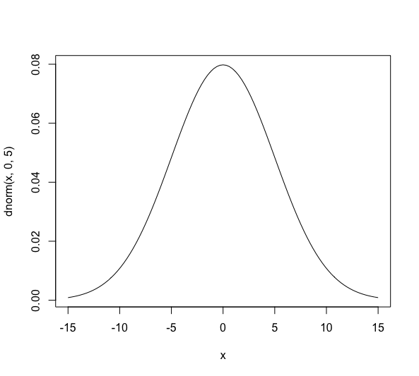
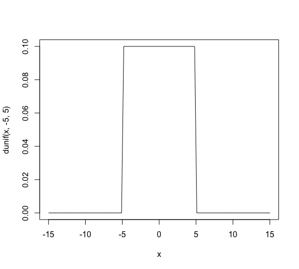
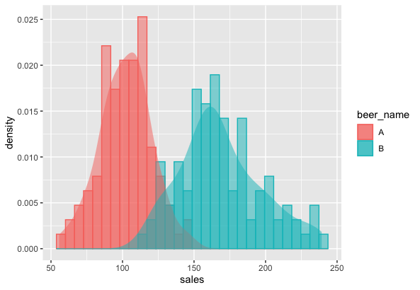

name: inverse
layout: true
class: center, middle, inverse
---
# Basis of stan coding
<br>Rとstanではじめるベイズ統計モデリングによるデータ分析入門 
<br>Makino Lab reading circle  7/1 Itoh Thoma
---
layout:false
### スタンコーディングの詳細
### 一般化線形モデルの基本

---
## Structure of stan file
.right-column[
<br>
functions{}:  Define original function here
<br><br>
<b>data{}:  Define used data and its sample size</b>
<br><br>
transformed data{}:  Define data transformation
<br><br>
<b>parameters{}:  Define parameters which you want to know the posterior distribution</b>
<br><br>
transformed parameters{}: Define parameters transformation
<br><br>
<b>model{}: Define model structure</b>
<br><br>
generated quantities{}: Get posterior distribution
]
.left-column[
```cpp
data {
  //こういう標本データが与えられていて
  int N;   
  vector[N] sales;   


parameters {
  //これらのパラメータを推定したい
  real mu;      
  real<lower=0> sigma;    
}

model {
  //パラメータはわからないけど
  //標本データは正規分布に従うと仮定
  for (i in 1:N){
    sales[i] ~ normal(mu, sigma);
  }
}
//最後に空白行が必要
```
]

---
## Declaration of variavles

Number
```cpp
int N;        // Declare variable N as integer type  
real beta;    // Declare variable beta as real number

//Specify range
real<lower=0> sigma;          // Greater than or equal to zero, integer
int<lower=0, upper=1> range;  // Range 0 to 1, real number
```

Vector, Matrix 
```cpp
vector[3] retu;               // Column vector with three elements
row_vector[10] gyou;          // Row vector with 10 elements
matrix[3,2] mat;              // Matrix with 3 rows and 2 columns 
```

Array
```cpp
int W[10];                    //Array with integer type of 10 elements
real X[3,4];                  //Array with real number type of 3 rows and 4 columns
vector[4] Y[2];               //Array with two vectors with four elements
matrix[3,4] z[5,6];           //Array with 5 x 6 matrix with 3 x 4 matrix
```

---
## Sampling statement

<p>Define posterior distribution and samplle data distribution</P>
  
```cpp
//事前分布の設定
mu ~ normal(0, 1000000);
sigma ~ normal(0, 1000000);

//パラメータはわからないけど
//標本データは正規分布に従うと仮定
model{
  for (i in 1:N){
    sales[i] ~ normal(mu, sigma);
  }
}
//

```

---
## Weak-informative prior distribution
.left-column[
#### Sometimes, we can estimate the range of parameters.
><p>i.e., Daily sales of a store can not be 50 trillion yen</p>

><p>When we can estimate that the range of parameter bete is -5 to 5, 
  we can specify prior distribution as </p>
  
>  *beta* ~ normal(0, 5); 
 
#### Bad weak-informative prior distribution

> *beta* ~ uniform(-5, 5);<br>
> beta takes only -5 to 5 values. It's better to allow unexpected number. 
  
]

.right-column[
 <br>
 
]

---
## Log-density additional statements
#### Other format of sampling statement in model block 

Likelihood function<br>


```cpp
model{
  for (i in 1:N){
    sales[i] ~ normal(mu, sigma); //sampling statement
  }
}
```

Log likelihood is calculated as below<br>
<a href="https://www.codecogs.com/eqnedit.php?latex=\sum&space;_{i=1}^Nlog(Normal(sales|\mu,\sigma^2))" target="_blank"></a>

<a href="https://www.codecogs.com/eqnedit.php?latex=log(Normal(sales|\mu,\sigma^2))" target="_blank"></a> is corresponds to `normal_lpdf(sales[i] | mu, sigma)`

```cpp
model{
  for (i in 1:N){
    target += normal_lpdf(sales[i] | mu, sigma); //Log-density additional statements
  }
}

```
---
## Evaluation of average difference and generated quantities block

#### Is there a difference in sales between Beer A and Beer B?

- #### Classic statistcs: Test difference between average of two groups
  - Test using assumed distribution like t-distribution
 
- #### Bysian statistcs: Get posterior distribution of difference between average of two groups</p>
  - Test using estiated distribution by MCMC
<br>



---
## Evaluation of average difference and generated quantities block
#### Get posterior distribution of difference between average of two groups
<p>R: Data preparation</p>
```R
> head(file_beer_sales_ab)
   sales beer_name
1  87.47         A
2 103.67         A
3  83.29         A
4 131.91         A
5 106.59         A
6  83.59         A
```

```R
#Rscript
sales_a <- file_beer_ab$sales[1:100]
sales_b <- file_beer_ab$sales[101:200]

data_list_ab <- list{
  sales_a = sales_a,
  sales_b = sales_b,
  N = 100
}
```

---
## Evaluation of average difference and generated quantities block
#### Get posterior distribution of difference between average of two groups
<p>Stan Model preparation</p>
.left-column[
```cpp
data {
  int N;                
  vector[N] sales_a;     
  vector[N] sales_b;     
}

parameters {
//これらのパラメータを推定
  real mu_a;               
  real<lower=0> sigma_a;    
  real mu_b;               
  real<lower=0> sigma_b;  
}

model {
  sales_a ~ normal(mu_a, sigma_a);
  sales_b ~ normal(mu_b, sigma_b);
}

generated quantities {
 // ビールAとBの売り上げ平均の差
  real diff;               
  diff = mu_b - mu_a;
}
```
]

.right-column[
- Distribution of diff can be estimated from model of mu_a and mu_b

- Unlike mu and sigma, diff is not needed to estimate model

- Generated quantities{} is faster than model{}

- Non related paeameters to estimate model is proper to written in Generated quantities{}

]

---
## Evaluation of average difference and generated quantities block

#### Get posterior distribution of difference between average of two groups

<p>Rscript</p>
```R
# 乱数の生成
mcmc_result_6 <- stan(
  file = "2-6-5-difference-mean.stan", 
  data = data_list_db,  
  seed = 1
)
```

---
#　Generalized linear model (GLM)

- #### Basis of GLM
- #### Example of GLM
- #### Matrix expression of GLM

---


