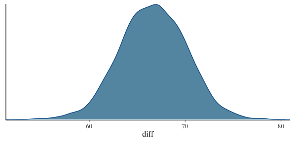

name: inverse
layout: true
class: center, middle, inverse
---
# Details of stan coding
# Basis of generalized linear model 
<br>Rとstanではじめるベイズ統計モデリングによるデータ分析入門 
<br>Makino Lab reading circle  7/1 Itoh Thoma

---
layout:false
## Structure of stan file
.right-column[
<br>
functions{}:  Define original function here
<br><br>
<b>data{}:  Define used data and its sample size</b>
<br><br>
transformed data{}:  Define data transformation
<br><br>
<b>parameters{}:  Define parameters which you want to know the posterior distribution</b>
<br><br>
transformed parameters{}: Define parameters transformation
<br><br>
<b>model{}: Define model structure</b>
<br><br>
generated quantities{}: Get posterior distribution
]
.left-column[
```cpp
data {
  //こういう標本データが与えられていて
  int N;   
  vector[N] sales;   


parameters {
  //これらのパラメータを推定したい
  real mu;      
  real<lower=0> sigma;    
}

model {
  //パラメータはわからないけど
  //標本データは正規分布に従うと仮定
  for (i in 1:N){
    sales[i] ~ normal(mu, sigma);
  }
}
//最後に空白行が必要
```
]

---
## Declaration and assignment

Number
```cpp
int N;        // Declare variable N as integer type  
real beta;    // Declare variable beta as real number

//Specify range
real<lower=0> sigma;          // Greater than or equal to zero, integer
int<lower=0, upper=1> range;  // Range 0 to 1, real number
```

Vector, Matrix 
```cpp
vector[3] retu;               // Column vector with three elements
row_vector[10] gyou;          // Row vector with 10 elements
matrix[3,2] mat;              // Matrix with 3 rows and 2 columns 
```

Array
```cpp
int W[10];                    //Array with integer type of 10 elements
real X[3,4];                  //Array with real number type of 3 rows and 4 columns
vector[4] Y[2];               //Array with two vectors with four elements
matrix[3,4] z[5,6];           //Array with 5 x 6 matrix with 3 x 4 matrix
```

Assignment statement
```
transformed_mu = exp(mu);
```

---
## Sampling statement

<p>Define posterior distribution and samplle data distribution</P>
  
```cpp
model{

  //事前分布の設定
  mu ~ normal(0, 1000000);
  sigma ~ normal(0, 1000000);

  //パラメータはわからないけど
  //標本データは正規分布に従うと仮定
  for (i in 1:N){
    sales[i] ~ normal(mu, sigma);
  }
}
//

```

---
## Weak-informative prior distribution
.left-column[
#### Sometimes, it's possible to estimate the range of parameters.
> Daily sales of a store can not be 50 trillion yen<br>

When we estimate that range of parameter *beta* is -5 to 5, 
  prior distribution is specified as followed
  
>  *beta* ~ normal(0, 5); 
 
#### Bad weak-informative prior distribution

> *beta* ~ uniform(-5, 5);<br>

In thi model, *beta* takes only -5 to 5 values. It's better to allow unexpected number. 
  
]

.right-column[
 <br>
 
]

---
## Log-density additional statements
#### Other format of sampling statement in model block 

```cpp
model{
  for (i in 1:N){
    sales[i] ~ normal(mu, sigma); //sampling statement
  }
}
```
Likelihood <br>


Log likelihood is calculated as below<br>
<a href="https://www.codecogs.com/eqnedit.php?latex=\sum&space;_{i=1}^Nlog(Normal(sales|\mu,\sigma^2))" target="_blank"></a>

<a href="https://www.codecogs.com/eqnedit.php?latex=log(Normal(sales|\mu,\sigma^2))" target="_blank"></a> is corresponds to `normal_lpdf(sales[i] | mu, sigma)`

```cpp
model{
  for (i in 1:N){
    target += normal_lpdf(sales[i] | mu, sigma); //Log-density additional statements
  }
}

```
---
## Evaluation of average difference and generated quantities block

#### Is there a difference in sales between Beer A and Beer B?

- #### Classic statistcs
  - Statistical hypothesis test using t-distribution
 
- #### bayesian statistcs
  - Observe the posterior distribution of difference directly
<br>


---
## Evaluation of average difference and generated quantities block
#### Estimate posterior distribution of difference between average of two groups
<p>R: Data preparation</p>

```R
> file_beer_ab <- read.csv("2-6-1-beer-sales-ab.csv")
> head(file_beer_sales_ab)
   sales beer_name
1  87.47         A
2 103.67         A
3  83.29         A
4 131.91         A
5 106.59         A
6  83.59         A
```

```R
#Rscript
sales_a <- file_beer_ab$sales[1:100]
sales_b <- file_beer_ab$sales[101:200]

data_list_ab <- list(
  sales_a = sales_a,
  sales_b = sales_b,
  N = 100
)
```

---
## Evaluation of average difference and generated quantities block
#### Estimate posterior distribution of difference between average of two groups
<p>Stan Model preparation</p>
.left-column[

```cpp
data {
  int N;                
  vector[N] sales_a;     
  vector[N] sales_b;     
}

parameters {
//これらのパラメータを推定
  real mu_a;               
  real<lower=0> sigma_a;    
  real mu_b;               
  real<lower=0> sigma_b;  
}

model {
  sales_a ~ normal(mu_a, sigma_a);
  sales_b ~ normal(mu_b, sigma_b);
}

generated quantities {
 // ビールAとBの売り上げ平均の差
  real diff;               
  diff = mu_b - mu_a;
}
```
]

.right-column[
- Distribution of diff is estimated from model of mu_a and mu_b

- Unlike mu and sigma, diff is not needed to estimate model

- Generated quantities{} is faster than model{}

- Non related paeameters to estimate model is proper to written in Generated quantities{}

]

---
## Evaluation of average difference and generated quantities block
#### Estimate posterior distribution of difference between average of two groups

<p>Rscript</p>

```R
# 乱数の生成
mcmc_result_6 <- stan(
  file = "2-6-5-difference-mean.stan", 
  data = data_list_ab,  
  seed = 1
)
```
結果

```
> print(mcmc_result, probs = c(0.025, 0.5, 0.975))
           mean se_mean   sd    2.5%     50%   97.5% n_eff Rhat
mu_a     102.22    0.03 1.84   98.64  102.22  105.90  4352    1
sigma_a   18.19    0.02 1.30   15.84   18.12   20.96  3742    1
mu_b     168.88    0.05 2.92  163.14  168.91  174.54  3627    1
sigma_b   29.11    0.03 2.09   25.37   28.96   33.63  4374    1
diff      66.66    0.05 3.50   59.84   66.67   73.44  4094    1
lp__    -719.42    0.03 1.45 -723.21 -719.07 -717.65  2249    1
```

---
## Evaluation of average difference and generated quantities block
#### Estimate posterior distribution of difference between average of two groups

###### 95% dysian credt section is 59.82 to 73.55
###### Difference between average of two groups has this much




---
## Generalized linear model (GLM)

- #### Basis of GLM
- #### Example of GLM
- #### Matrix expression of GLM

---
## Possibility distribution・Linear predictor・Link function

#### GLM is composed from possibility distribution, linear predictor, link function
Possibility distribution is necessary to describe stochastic process that creates observed data<br>

Responsible valiable:   Interested variable<br>
Explanatory valiable:   Variable that affect responsible variable<br>
Liear predictor:        Linear combination of explanatory variables<br>
Link function:          Function that connects linear predictor and responsible valiable<br>

>Link function ( Responsible variables ) = Linear predictor


><a href="https://www.codecogs.com/eqnedit.php?latex=u_i&space;=&space;\beta_0&space;&plus;&space;\beta_1x_1&space;&plus;&space;\beta_1x_2" target="_blank"></a><br>
<!-- section one -->
> In this case, link function is an identity function<br>
><a href="https://www.codecogs.com/eqnedit.php?latex=g(u_i)&space;=&space;u_i" target="_blank"></a><br>
>
<br>
 - - - 
<!-- section two -->
><a href="https://www.codecogs.com/eqnedit.php?latex=log(u_i)&space;=&space;\beta_0&space;&plus;&space;\beta_1x_1&space;&plus;&space;\beta_1x_2" target="_blank"></a><br>
>In this case, link function is log()<br>
><br>

---

## Analysis of variance model

#### When explanatory variables are categorical data, dammy variables are used instead.

| Categorical　| Dammy |
| ---- | ---- |
|  Rainy      |  1  |
|  Sunny      |  0  |


#### If there are k categorical variables, k-1 dummy variables are needed
 is dummy variable which takes 0 when rainy and takes 1 when sunny<br>
 is dummy variable which takes 1 when rainy and takes 0 when sunny<br>
  
<br>
<br>

| Whether |  |
| ---- | ---- |
|  Cloudy  | <a href="https://www.codecogs.com/eqnedit.php?latex=\beta_0" target="_blank"></a>  |
|  Sunny      |  <a href="https://www.codecogs.com/eqnedit.php?latex=\beta_0&space;&plus;&space;\beta_1" target="_blank"></a>  |
|  Rainy     |  <a href="https://www.codecogs.com/eqnedit.php?latex=\beta_0&space;&plus;&space;\beta_2" target="_blank"></a>  |

#### Explanatory variables are categorical data, and possibility distribution is normal distribution.
#### Such a model is called Analysis of variance model 

---

## Normal linear model
#### Model that assuming a normal distribution<br> 
<br> 

 is dummy variable which takes 0 when rainy and takes 1 when sunny<br>
 is dummy variable which takes 1 when rainy and takes 0 when sunny<br>
 is temperature data<br>
<!-- equation -->
<br>
<br>

 #### Model that have below properties is called normal linear model
 1. Multipe explanatory variables can be used to linear predictor with regardless of categorical or qualitative data
 2. Identity function is kink function
 3. Normal distribution is used as possibility distribution
 
---
 
## Poisson regression model
#### Model that assuming a poisson distribution
#### When responsible values takes integer that greater than 0, poisson distribution is often used. <br>
<br> 
<br>
<br>

Below is the same mean
<br>


#### Model that have below properties is called normal poisson regression model
 1. Multipe explanatory variables can be used to linear predictor with regardless of categorical or qualitative data
 2. Log function is link function
 3. Poisson distribution is used as possibility distribution

---
## Logistic regression model
#### Model that assuming a binomial distribution
#### When responsible values are binary random variable, binomial distribution is often used. 

<br>
<br>

Link function is logit function | reverse function of logistic function<br>
<br>
<br>
<br>

Because logistic finction takes 0 to 1, it's useful to express possibility<br>

#### Model that have below properties is called logistic regression model
 1. Multipe explanatory variables can be used to linear predictor with regardless of categorical or qualitative data
 2. Logit function is link function
 3. Binomial distribution is used as possibility distribution


---
## Matrix expression of GLM
#### Poisson regression 
<br>
#### This can be described as followed
<br>

<p>Little complex expression ...</p> 

#### By using matrix, linear predictor can be described as followed


<br>
<br>
<p>Became quit simpler now</p>


---


